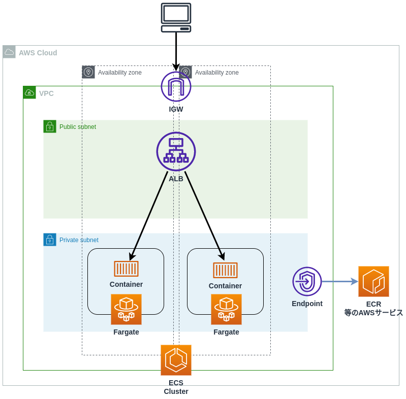

# これはなに？
terraformでECS(Fargate)+ALBの構成を作るリポジトリです。  
ECSタスクはプライベートサブネットに配置されており、以下動作を可能にするためVPCエンドポイントを作成しています。

- ECRからのイメージプル
- CloudwatchLogsへのログ転送
- コンテナへの`ECS EXEC`

# 何が出来る？
以下の構成が作れます。  


terraform実行後にALBのパブリックDNSが出力されるため、そこからアクセス可能です。

# 事前準備
- ECRの用意
- コンテナイメージをECRへプッシュ
- プッシュしたイメージのURLをmain.tfの`app`モジュールで指定

```hcl:main.tf
module "app" {
  source          = "../../modules/app"
  container-image = "<ECRに格納したイメージのURL>"
}
```

# ECS EXEC
```bash
# task idを出す
$ aws ecs list-tasks --cluster <ECSクラスタ名>

# ECS EXECする
$ aws ecs execute-command --cluster <ECSクラスタ名> \
    --task <task id> \
    --container <コンテナ名> \
    --interactive \
    --command "/bin/bash"
```

# 注意
セキュリティは考慮されていません。  
ALBのセキュリティグループのinboundは`0.0.0.0/0`と開放されています。